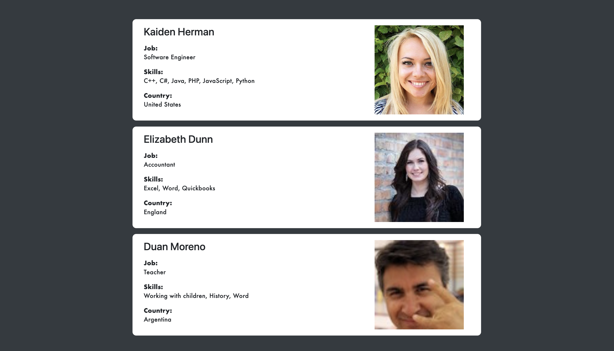

# User Profile Card List
This project dynamically generates a list of user profile cards using vanilla JavaScript. Each card presents an employee's name, job title, skills, country, and avatar image in a clean, responsive layout.

[Live Demo](https://nanachiki.github.io/User-Profile-Card-List/)



## Features
- **Object-Oriented Design**: Uses an `Employee` class for modular and maintainable code.
- **Dynamic Rendering**: Employee cards are created and appended to the DOM automatically.
- **Responsive Layout**: Cards are styled to look good on various screen sizes.(requires appropriate CSS).
- **Error Handling**: Logs a warning if the target container is missing in the HTML.
- **Accessible**: Avatar images include descriptive `alt` text.

## Technologies Used
- HTML5
- CSS3 (Bootstrap for layout, custom styles)
- JavaScript (ES6+)

## Getting Started
### Prerequisites

- A modern web browser
- [Node.js](https://nodejs.org/)(optional, if you want to use a local server for development)

### Installation
1. Clone the repository:
```
git clone https://github.com/NanaChiki/User-Profile-Card-List.git
cd User-Profile-Card-List
```
2. Open the project folder in your code editor(e.g., VSCode).
3. Ensure your HTML file includes a container with the id `profiles`:
```html
<div id="profiles"></div>
```
4. Link the JavaScript file in your HTML:
```html
<script src="User-Profile-Card-List.js/main.js"></script>
```
5. Open the HTML file in a browser to view the profile cards.

## Usage
- To add or modify employees, edit the `employees` array in the `main.js`.
- Each `Employee` object instance requires:
  - First name
  - Last name
  - Job title
  - Skills (comma-separated string)
  - Country
  - Avatar image URL
  
### Example:
```javascript
new Employee(
  "Jane", "Doe", "Designer",
  "Photoshop, Illustrator, Figma",
  "Canada",
  "https://example.com/avatar.jpg"
)
```

## Customization
- Styling:
  Adjust or extend the CSS to match your design preferences.
- Card Content:
  Add more fields to the `Employee` class and update the card rendering logic as needed.

## Contributing
Contributions are welcome! Please open an issue or submit a pull request.

## Error Handling
If the container with id `profiles` is not found in the HTML, a warning will be logged in the browser console.

---
Enjoy building and customizing your user profile card list!
